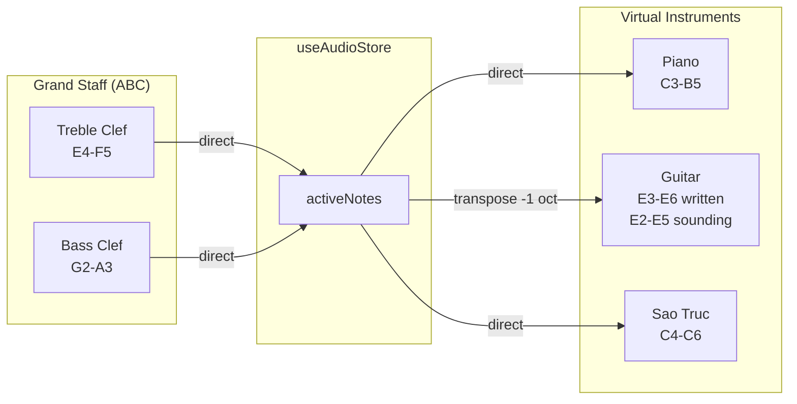

# Staff-Instrument Mapping Rules

> **Last Updated:** 2026-01-24  
> **Purpose:** Reference documentation for mapping between Grand Staff notation and Virtual Instruments

This document describes how our music theory application maps notes between the **Grand Staff** (treble and bass clefs) and our three virtual instruments: **Piano**, **Guitar**, and **Sao Truc (Flute)**.

---

## Overview

The application uses a **unified pitch representation** based on Scientific Pitch Notation (e.g., `C4`, `E5`). All instruments synchronize through the `activeNotes` array in `useAudioStore`, ensuring that when a note is played or clicked on the staff, it highlights correctly across all visible instruments.

---

## Instrument Ranges

### 1. Virtual Piano (Non-Transposing)

| Property          | Value                    |
| ----------------- | ------------------------ |
| **Range**         | **C3 to B5** (3 octaves) |
| **Start Octave**  | 3                        |
| **Octave Count**  | 3                        |
| **Transposition** | None (concert pitch)     |

**Implementation:**

```tsx
<VirtualPiano startOctave={3} octaves={3} ... />
```

The piano is a non-transposing instrument. Notes on the staff correspond directly to the keys:

- **C3** appears on bass clef with ledger lines below
- **C4 (Middle C)** is on the ledger line between bass and treble clefs
- **C5** is on the treble clef

---

### 2. Virtual Guitar (Transposing Instrument)

| Property           | Value                                                          |
| ------------------ | -------------------------------------------------------------- |
| **Sounding Range** | **E2 to E5** (≈3 octaves)                                      |
| **Written Range**  | **E3 to E6** (transposed up 1 octave)                          |
| **Fret Range**     | 0-8 frets displayed (up to 15 supported)                       |
| **Tuning**         | Standard: E4, B3, G3, D3, A2, E2 (strings 1-6)                 |
| **Transposition**  | **+1 octave** (written pitch is 1 octave higher than sounding) |

> [!IMPORTANT]
> **Guitar is a transposing instrument.** Written music is notated **one octave higher** than the actual sounding pitch.

**Transposition Logic (from `guitar-logic.ts`):**

```typescript
// Guitar sounding → Written (staff display)
export const transposeGuitarToWritten = (soundingNote: string): string | null => {
  const parsed = parseNote(soundingNote)
  if (!parsed) return null
  const writtenOctave = parsed.octave + 1 // +1 octave
  return `${parsed.noteName}${writtenOctave}`
}

// Written (staff) → Guitar sounding (fretboard position)
export const transposeWrittenToGuitar = (writtenNote: string): string | null => {
  const parsed = parseNote(writtenNote)
  if (!parsed) return null
  const soundingOctave = parsed.octave - 1 // -1 octave
  if (soundingOctave < 2) return null // Below guitar range
  return `${parsed.noteName}${soundingOctave}`
}
```

**Practical Examples:**

| Staff Position               | Written Pitch | Guitar Sounding Pitch | String/Fret Position     |
| ---------------------------- | ------------- | --------------------- | ------------------------ |
| Bottom of bass clef (ledger) | E3            | E2                    | Low E string, open       |
| First line of treble clef    | E4            | E3                    | D string, 2nd fret       |
| Top space of treble clef     | E5            | E4                    | High E string, open      |
| Above treble clef (ledger)   | E6            | E5                    | High E string, 12th fret |

---

### 3. Sao Truc / Flute (Non-Transposing)

| Property          | Value                  |
| ----------------- | ---------------------- |
| **Range**         | **C4 to C6** (6-hole)  |
| **Range**         | **C4 to C5** (10-hole) |
| **Transposition** | None (concert pitch)   |

**Hole-to-Note Mapping (simplified, from InstrumentPanel):**

```tsx
const holes = [
  { id: 1, notes: ['D4', 'D5'] },
  { id: 2, notes: ['E4', 'E5'] },
  { id: 3, notes: ['F4', 'F5', 'F#4', 'F#5'] },
  { id: 4, notes: ['G4', 'G5'] },
  { id: 5, notes: ['A4', 'A5'] },
  { id: 6, notes: ['B4', 'B5'] },
]
```

The Sao Truc uses a **fingering engine** (`fingering-engine.ts`) that maps scientific pitch notation to specific hole patterns defined in `fingerings.json`.

---

## Staff Clef Mapping

### Treble Clef (G Clef)

| Staff Position       | Note | ABC Notation |
| -------------------- | ---- | ------------ |
| Bottom line (E line) | E4   | `E`          |
| 1st space            | F4   | `F`          |
| 2nd line (G line)    | G4   | `G`          |
| 2nd space            | A4   | `A`          |
| 3rd line (B line)    | B4   | `B`          |
| 3rd space            | C5   | `c`          |
| 4th line (D line)    | D5   | `d`          |
| 4th space            | E5   | `e`          |
| Top line (F line)    | F5   | `f`          |

**Mnemonic (Line Notes):** E - G - B - D - F ("Every Good Boy Does Fine")  
**Mnemonic (Space Notes):** F - A - C - E ("FACE")

---

### Bass Clef (F Clef)

| Staff Position       | Note | ABC Notation |
| -------------------- | ---- | ------------ |
| Bottom line (G line) | G2   | `G,,`        |
| 1st space            | A2   | `A,,`        |
| 2nd line (B line)    | B2   | `B,,`        |
| 2nd space            | C3   | `C,`         |
| 3rd line (D line)    | D3   | `D,`         |
| 3rd space            | E3   | `E,`         |
| 4th line (F line)    | F3   | `F,`         |
| 4th space            | G3   | `G,`         |
| Top line (A line)    | A3   | `A,`         |

**Mnemonic (Line Notes):** G - B - D - F - A ("Good Boys Do Fine Always")  
**Mnemonic (Space Notes):** A - C - E - G ("All Cows Eat Grass")

---

### Grand Staff (Combined View)

```
                         ┌─── F5 (top line treble)
     Treble Clef ────────┼─── E4 (bottom line treble)
                         │
        Middle C ────────┼─── C4 (ledger line)
                         │
      Bass Clef ─────────┼─── A3 (top line bass)
                         └─── G2 (bottom line bass)
```

**Middle C (C4)** sits on a ledger line between the two staves.

---

## ABC Notation Octave Convention

ABC notation uses letter case and modifiers to indicate octaves:

| ABC Notation | Scientific Pitch | Octave       |
| ------------ | ---------------- | ------------ |
| `C,,`        | C2               | 2            |
| `C,`         | C3               | 3            |
| `C`          | C4               | 4 (Middle C) |
| `c`          | C5               | 5            |
| `c'`         | C6               | 6            |
| `c''`        | C7               | 7            |

**Rule Summary:**

- **Uppercase letters (A-G)** = Octave 4
- **Lowercase letters (a-g)** = Octave 5
- **Comma (,)** = Lower by one octave
- **Apostrophe (')** = Higher by one octave

---

## Instrument-Staff Cross-Reference

This table shows which staff (treble or bass) is most appropriate for each instrument's range:

| Instrument   | Range           | Primary Clef       | Secondary Clef          |
| ------------ | --------------- | ------------------ | ----------------------- |
| **Piano**    | C3-B5           | Both (Grand Staff) | —                       |
| **Guitar**   | E3-E6 (written) | Treble Clef        | Bass Clef for low notes |
| **Sao Truc** | C4-C6           | Treble Clef only   | —                       |

---

## Quiz/Assessment Clef Selection Logic

For note identification quizzes, the clef is selected based on the note's octave:

```typescript
// From NoteIdentificationQuiz.tsx
const octave = parseInt(currentNote.match(/\d/)?.[0] || '4')
const clef = octave < 4 ? 'bass' : 'treble'
```

**Logic:**

- **Octave < 4** (C3, G2, etc.) → Bass Clef
- **Octave ≥ 4** (C4, E5, etc.) → Treble Clef

---

## Data Flow Summary



---

## Out-of-Range Behavior

When a note from the staff or another instrument falls **outside** an instrument's playable range, each instrument handles it differently:

### Behavior Summary

| Instrument   | Range          | Out-of-Range Behavior | User Feedback                              |
| ------------ | -------------- | --------------------- | ------------------------------------------ |
| **Piano**    | C3-B5          | Silent fail           | None — key simply doesn't highlight        |
| **Guitar**   | E3-E6 written  | Silent fail           | None — no fret position highlights         |
| **Sao Truc** | C4-C6 (6-hole) | Graceful degradation  | Shows **"Note: X (Out of Range)"** message |

---

### 1. Piano (Silent Fail)

The piano uses a simple `includes()` check for highlighting:

```tsx
// VirtualPiano.tsx
isHighlighted={activeNotes.includes(note)}
```

**Behavior:** If the note (e.g., `G2`) is not in the rendered key list (`C3`-`B5`), the check returns `false` and no key lights up. There is no visual or textual indication that the note is out of range.

**Example:**

- Staff plays `G2` (bass clef) → Piano shows nothing (G2 < C3)
- Staff plays `C6` (above treble) → Piano shows nothing (C6 > B5)

---

### 2. Guitar (Silent Fail with Transposition Check)

The guitar performs a transposition before looking for fret positions:

```tsx
// VirtualGuitar.tsx
const soundingNote = transposeWrittenToGuitar(writtenNote)
if (soundingNote) {
  const positions = getPositionsForNote(soundingNote)
  // Only positions within first 8 frets are shown
  positions.forEach((pos) => {
    if (pos.fret <= TOTAL_FRETS) {
      map.set(`${pos.stringIndex}-${pos.fret}`, true)
    }
  })
}
```

```tsx
// guitar-logic.ts
export const transposeWrittenToGuitar = (writtenNote: string): string | null => {
  // ...
  const soundingOctave = parsed.octave - 1
  if (soundingOctave < 2) return null // Below guitar range
  return `${parsed.noteName}${soundingOctave}`
}
```

**Behavior:**

- Notes below `E3` written → `transposeWrittenToGuitar()` returns `null` → no highlight
- Notes above `E6` written (or beyond fret 8) → `getPositionsForNote()` returns empty array → no highlight

**Example:**

- Staff plays `C3` → Guitar sounding would be `C2` → returns `null` → no fret lights up
- Staff plays `G6` → Guitar sounding `G5` → above highest position on fret 8 → no highlight

---

### 3. Sao Truc / Flute (Graceful Degradation with Feedback)

The flute is the **only instrument** that provides explicit user feedback:

```tsx
// SaoTrucVisualizer.tsx
const fingering = getFingering(effectiveNote, fluteType)
if (fingering) {
  setCurrentFingering(fingering.holes)
} else {
  // Handle invalid/out-of-range notes
  setCurrentFingering([]) // Empty array = no holes rendered
}

const getStatusText = () => {
  if (currentNote === '-') return 'Ready'
  const displayNote = getNoteLabel(currentNote, notationSystem)
  if (currentFingering.length === 0) return `Note: ${displayNote} (Out of Range)`
  return `Note: ${displayNote}`
}
```

**Behavior:**

- Notes not in `fingerings.json` → `getFingering()` returns `null`
- Status text shows: **"Note: G2 (Out of Range)"**
- Fingering chart shows no holes (empty visual state)

**Example:**

- Staff plays `G2` → Not in fingerings.json → Shows "Note: G2 (Out of Range)"
- Staff plays `D4` → Valid → Shows "Note: D4" with proper fingering

---

### Audio Behavior (All Instruments)

> [!NOTE]
> **Audio playback is independent of visual range.** The `audioEngine` (Tone.js) can synthesize any valid MIDI pitch, so the user will still _hear_ the note even if no instrument visually highlights it.

This separation means:

- ✅ Sound plays for all notes
- ❌ Visual highlighting only works within each instrument's range
- ⚠️ Piano and Guitar give no indication that a note is out of range

---

### UX Implications

| Scenario                    | Current Behavior                    | Potential Improvement                          |
| --------------------------- | ----------------------------------- | ---------------------------------------------- |
| Bass note played (G2)       | Piano/Guitar: nothing happens       | Could show a subtle "out of range" indicator   |
| Very high note (C7)         | All instruments: nothing highlights | Could show arrow pointing "above range"        |
| Quiz with out-of-range note | Student may be confused             | Should restrict quiz notes to instrument range |

---

## Key Files Reference

| File                                               | Purpose                                          |
| -------------------------------------------------- | ------------------------------------------------ |
| `src/components/VirtualPiano/VirtualPiano.tsx`     | Piano keyboard renderer (C3-B5, 3 octaves)       |
| `src/components/VirtualGuitar/VirtualGuitar.tsx`   | Guitar fretboard with transposition logic        |
| `src/utils/guitar-logic.ts`                        | Transposition utilities for guitar               |
| `src/components/instruments/InstrumentPanel.tsx`   | Unified panel showing all 3 instruments          |
| `src/features/sao-truc/logic/fingering-engine.ts`  | Flute fingering lookup engine                    |
| `src/features/sao-truc/logic/fingerings.json`      | Fingering patterns for 6-hole and 10-hole flutes |
| `src/data/course-data/module-1/1.1-staff-clefs.ts` | Module 1.1 content with ABC notation demos       |
| `src/components/modules/TheoryContent.tsx`         | Renders inline ABC with note click handlers      |
| `src/stores/useAudioStore.ts`                      | Central store for `activeNotes` array            |
